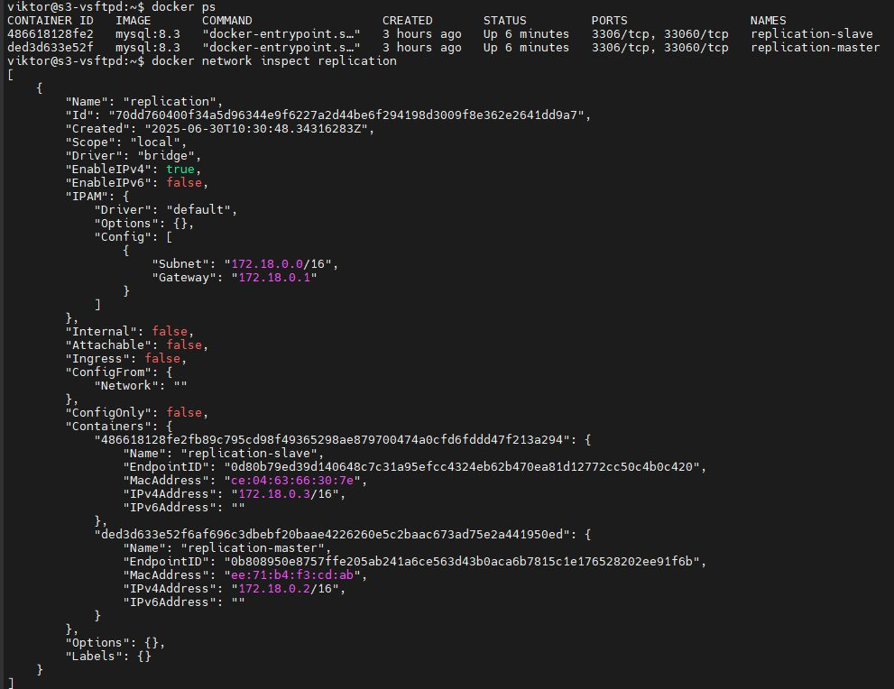
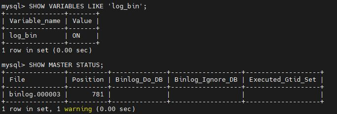
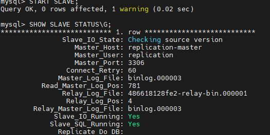
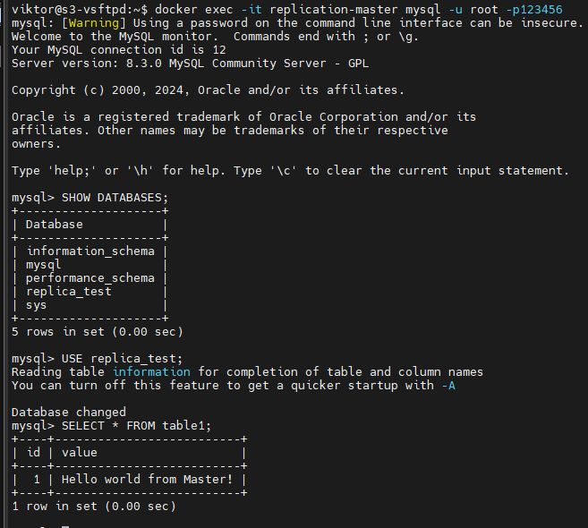
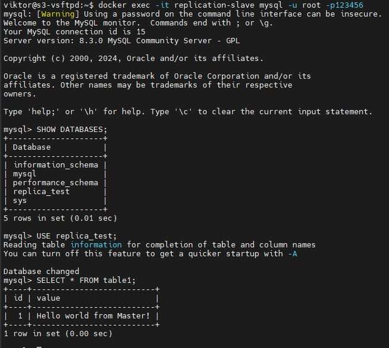

# Домашнее задание к занятию "`Репликация и масштабирование. Часть 1`" - `Лебедев Виктор`


### Инструкция по выполнению домашнего задания

   1. Сделайте `fork` данного репозитория к себе в Github и переименуйте его по названию или номеру занятия, например, https://github.com/имя-вашего-репозитория/git-hw или  https://github.com/имя-вашего-репозитория/7-1-ansible-hw).
   2. Выполните клонирование данного репозитория к себе на ПК с помощью команды `git clone`.
   3. Выполните домашнее задание и заполните у себя локально этот файл README.md:
      - впишите вверху название занятия и вашу фамилию и имя
      - в каждом задании добавьте решение в требуемом виде (текст/код/скриншоты/ссылка)
      - для корректного добавления скриншотов воспользуйтесь [инструкцией "Как вставить скриншот в шаблон с решением](https://github.com/netology-code/sys-pattern-homework/blob/main/screen-instruction.md)
      - при оформлении используйте возможности языка разметки md (коротко об этом можно посмотреть в [инструкции  по MarkDown](https://github.com/netology-code/sys-pattern-homework/blob/main/md-instruction.md))
   4. После завершения работы над домашним заданием сделайте коммит (`git commit -m "comment"`) и отправьте его на Github (`git push origin`);
   5. Для проверки домашнего задания преподавателем в личном кабинете прикрепите и отправьте ссылку на решение в виде md-файла в вашем Github.
   6. Любые вопросы по выполнению заданий спрашивайте в чате учебной группы и/или в разделе “Вопросы по заданию” в личном кабинете.
   
   Желаем успехов в выполнении домашнего задания.

---

---

Задание можно выполнить как в любом IDE, так и в командной строке.

### Задание 1

На лекции рассматривались режимы репликации master-slave, master-master, опишите их различия.

*Ответить в свободной форме.*

---

### Решение 1
 В архитектуре Master-Slave есть один сервер, который является главным (Master), и один или несколько серверов, которые являются подчиненными (Slave).
 Все записи в базу данных происходят только на Master-сервере. Slave-серверы только реплицируют данные с Master-сервера.
 В архитектуре Master-Master все серверы являются равноправными Master-серверами.
 Записи могут происходить на любом из Master-серверов. Данные реплицируются между всеми Master-серверами.

---

### Задание 2

Выполните конфигурацию master-slave репликации, примером можно пользоваться из лекции.

*Приложите скриншоты конфигурации, выполнения работы: состояния и режимы работы серверов.*

---

### Решение 2

Создаем контейнеры и сеть между ними
```
docker run -d --name replication-master -e MYSQL_ROOT_PASSWORD=123456 -d mysql:8.3
docker run -d --name replication-slave -e MYSQL_ROOT_PASSWORD=123456 -d mysql:8.3
docker network create replication
docker network connect replication replication-master
docker network connect replication replication-slave
```


Настройка мастера

```

SHOW VARIABLES LIKE 'log_bin';
SET GLOBAL server_id = 1;
CREATE USER 'replication'@'%';
GRANT REPLICATION SLAVE ON *.* TO 'replication'@'%';
FLUSH PRIVILEGES;
SHOW MASTER STATUS;
exit;

```


Настройка Slave для подключения к Master:
```
SET GLOBAL server_id = 2;
CHANGE MASTER TO
    MASTER_HOST='replication-master',
    MASTER_USER='replication',
    MASTER_LOG_FILE='binlog.000003',
    MASTER_LOG_POS=781;
START SLAVE;
SHOW SLAVE STATUS\G;
exit;
```

Таблицы на мастере:

Среплицированная таблица на реплике:

---